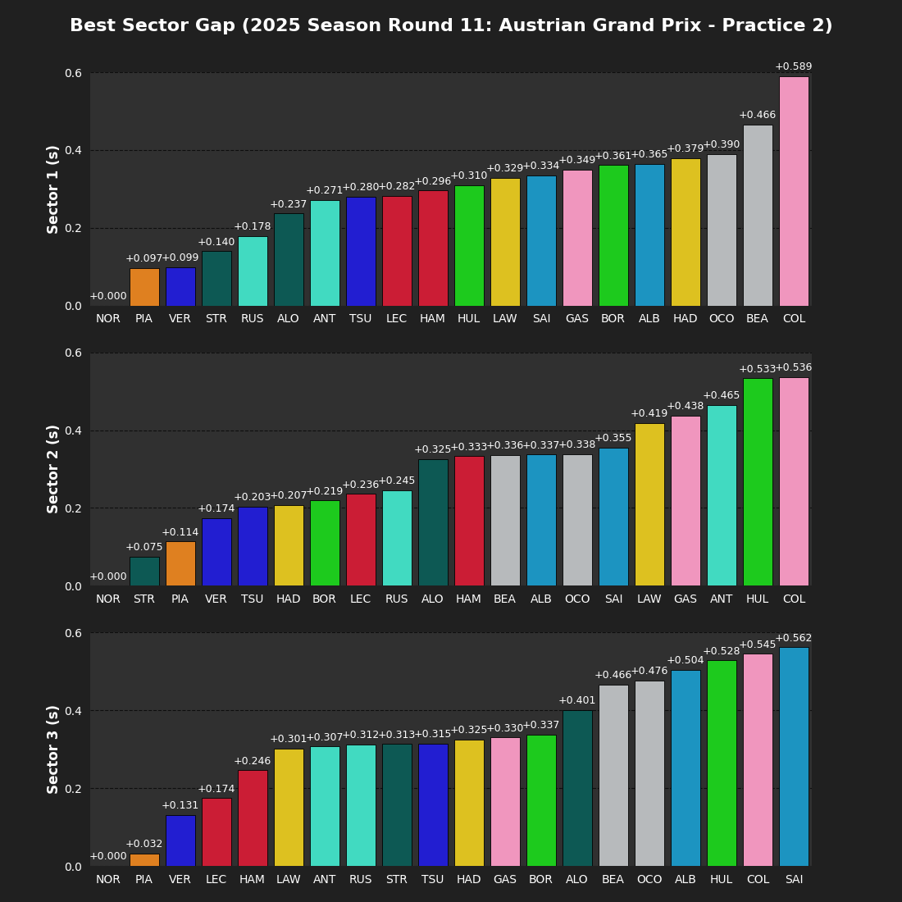
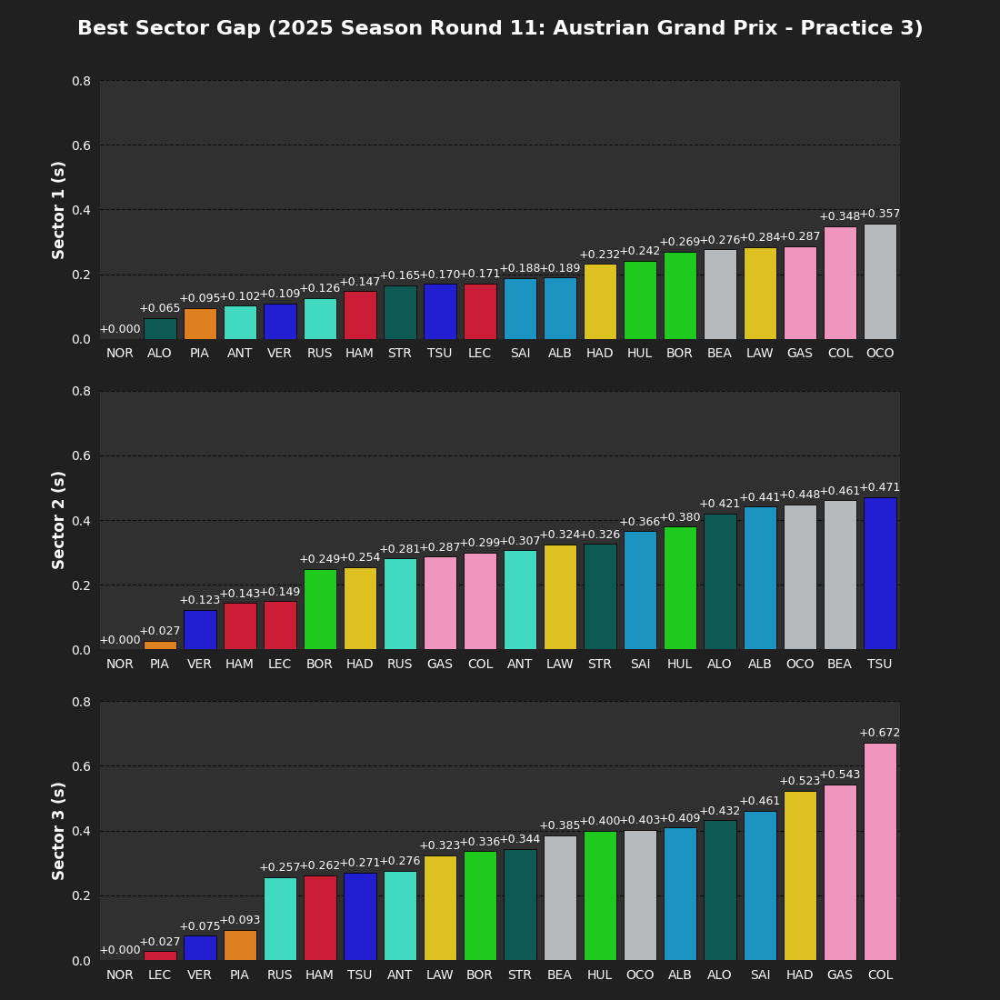
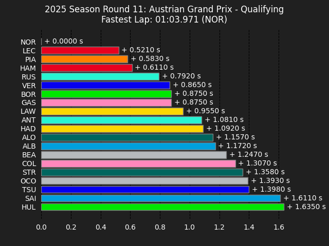
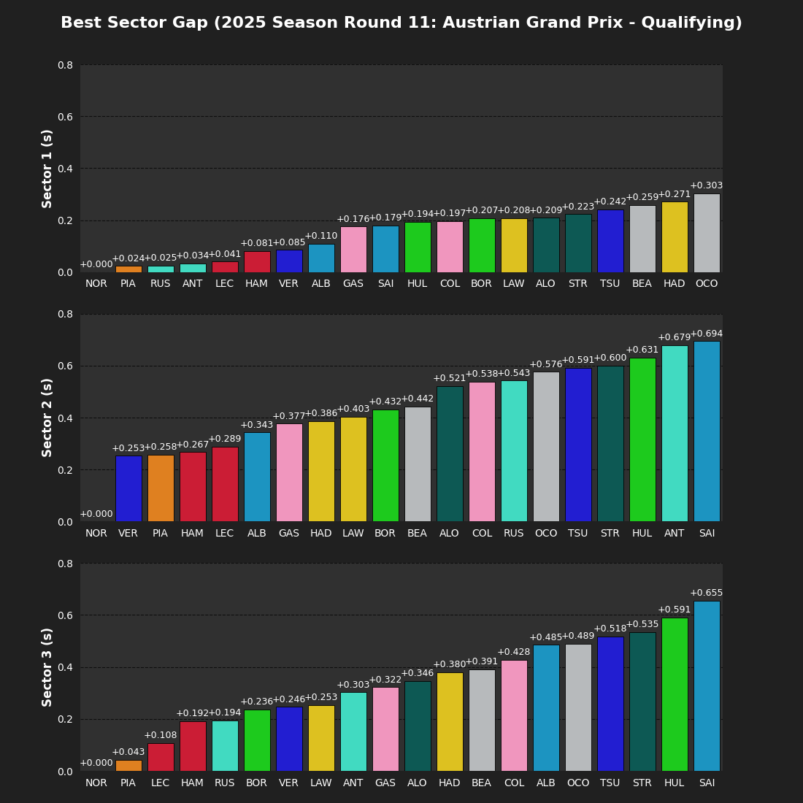
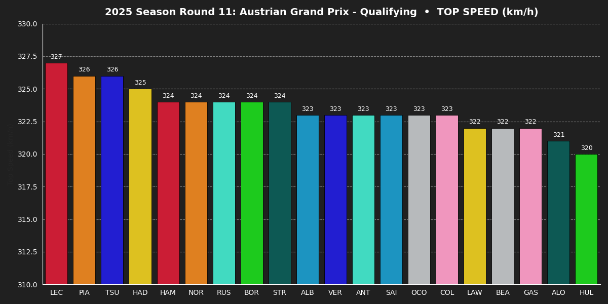
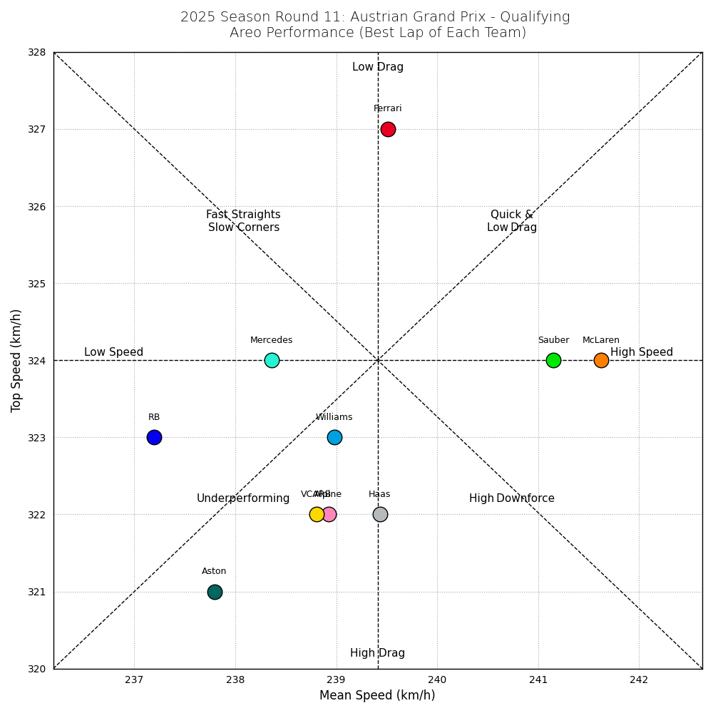
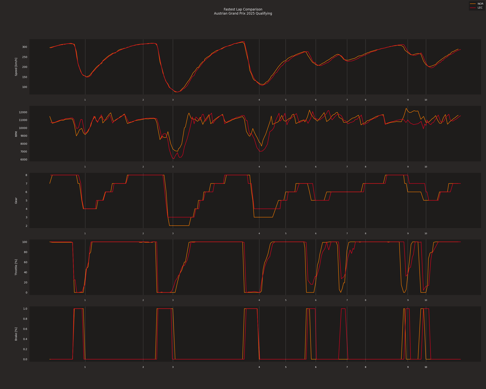
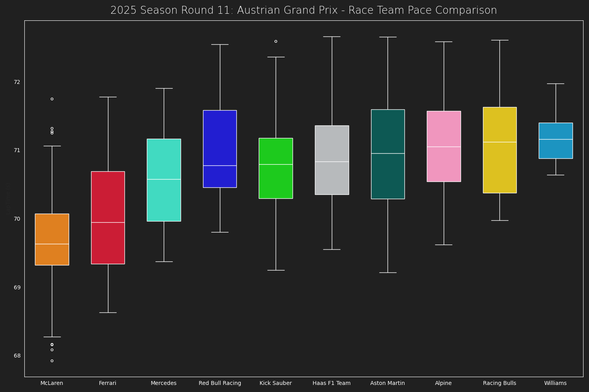
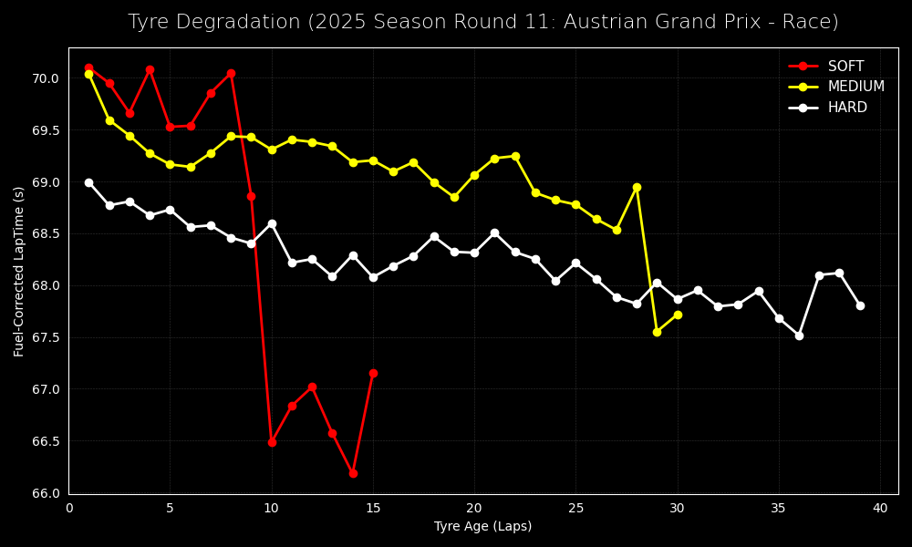

# 🏎️ F1 Auto Visualizer

This project automatically generates and updates a visual recap of every Formula 1 race weekend using data from the FastF1 library. After each Grand Prix, key performance metrics from practice, qualifying, and the race are analyzed and visualized—then embedded directly into this README. All updates are handled entirely through automation via GitHub Actions.

---

<strong>FP1</strong>

<!-- FP1_START -->

<!-- FP1_END -->

<strong>FP2</strong>

<!-- FP2_START -->

<!-- FP2_END -->

<strong>FP3</strong>

<!-- FP3_START -->

<!-- FP3_END -->

<strong>QUALIFYING</strong>

<!-- QUALIFYING_START -->

<!-- QUALIFYING_END -->

<strong>RACE</strong>

<!-- RACE_START -->

<!-- RACE_END -->

