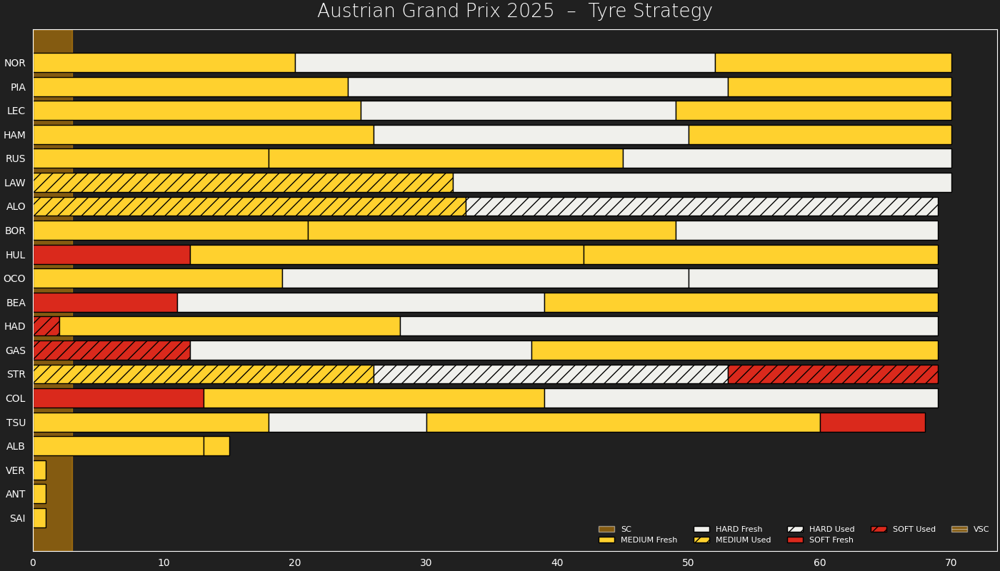

# 🏎️ F1 Auto Visualizer

Auto-updating charts after each F1 session.

---

## FP1
<!-- FP1_START -->

<!-- FP1_END -->

## FP2
<!-- FP2_START -->

<!-- FP2_END -->

## FP3
<!-- FP3_START -->

<!-- FP3_END -->

## Qualifying
<!-- QUALI_START -->
<!-- QUALI_END -->

## Race
<!-- RACE_START -->

<!-- RACE_END -->